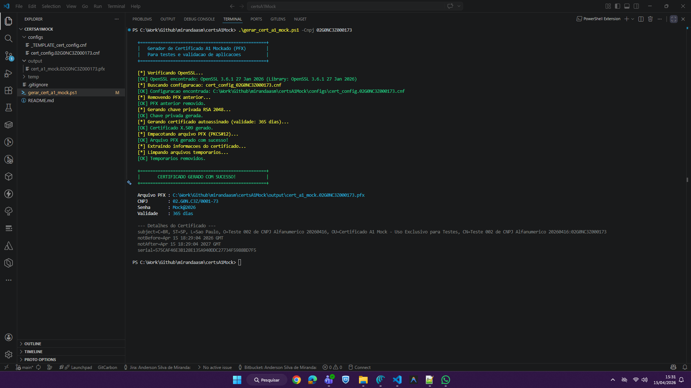

# certsA1Mock 🔐

Ferramenta para geração de **Certificados Digitais A1 mockados** (arquivo `.pfx`) para testes e validação de aplicações que processam certificados digitais — incluindo suporte a **CNPJ alfanumérico** (novo formato Receita Federal).

> ⚠️ **Aviso:** Os certificados gerados são **autoassinados** e destinados **exclusivamente para testes**. Não possuem validade jurídica nem são emitidos por uma AC credenciada pela ICP-Brasil.

---

## 📋 Pré-requisitos

**OpenSSL** instalado e disponível no PATH do Windows.

```powershell
# Instalar via winget (recomendado)
winget install ShiningLight.OpenSSL.Light
```

Após instalar, feche e reabra o terminal para que o `openssl` esteja no PATH.

---

## 📁 Estrutura do Repositório

```
certsA1Mock/
├── gerar_cert_a1_mock.ps1                      ← Ferramenta principal
├── configs/                                     ← Arquivos .cnf (um por CNPJ)
│   ├── _TEMPLATE_cert_config.cnf               ← Template para novos CNPJs
│   └── cert_config.02G0NC3Z000173.cnf          ← Exemplo: CNPJ 02.G0N.C3Z/0001-73
├── output/                                      ← PFX gerados (ignorado pelo Git)
└── temp/                                        ← Arquivos intermediários (ignorado pelo Git)
```

---

## 📐 Convenção de Nomes

A ferramenta adota uma convenção rígida de nomenclatura baseada no CNPJ (sempre em **letras maiúsculas**, **sem pontuação** — sem `.`, `/` ou `-`):

| Artefato | Padrão de Nome | Exemplo (CNPJ: `02G0NC3Z000173`) |
|---|---|---|
| **Config** | `configs/cert_config.{CNPJ}.cnf` | `configs/cert_config.02G0NC3Z000173.cnf` |
| **PFX gerado** | `output/cert_a1_mock.{CNPJ}.pfx` | `output/cert_a1_mock.02G0NC3Z000173.pfx` |
| **Chave** (temp) | `temp/cert_a1_mock.{CNPJ}.key` | Removido automaticamente |
| **Cert** (temp) | `temp/cert_a1_mock.{CNPJ}.crt` | Removido automaticamente |

> 💡 **Regra de ouro:** o CNPJ no nome do arquivo `.cnf` deve ser **exatamente** o mesmo valor informado ao executar o script (após conversão para maiúsculas). Ao informar `-Cnpj 02G0NC3Z000173`, a ferramenta buscará `cert_config.02G0NC3Z000173.cnf` e gerará `cert_a1_mock.02G0NC3Z000173.pfx`.

---

## 🚀 Como Usar

### ⚡ Uso Rápido — gerar certificado para um CNPJ já configurado

> **Pré-condição:** o arquivo de configuração `configs/cert_config.{CNPJ}.cnf` **já deve existir** antes de executar o comando abaixo. Caso ainda não exista, consulte a seção [Criar certificado para um novo CNPJ](#-criar-certificado-para-um-novo-cnpj) antes de prosseguir.

```powershell
# Informe o CNPJ sem pontuação — a ferramenta cuida do resto!
.\\gerar_cert_a1_mock.ps1 -Cnpj 02G0NC3Z000173

# Resultado gerado em: output\cert_a1_mock.02G0NC3Z000173.pfx
# Senha padrão: Mock@2026
```

---

### 🆕 Criar certificado para um novo CNPJ

Para gerar um certificado de um CNPJ ainda não cadastrado, siga os três passos abaixo:

**Passo 1 — Copiar o template com o nome correto**

O nome do arquivo de destino **deve obrigatoriamente** seguir o padrão `cert_config.{CNPJ_SEM_PONTUACAO}.cnf`, onde `{CNPJ_SEM_PONTUACAO}` é o CNPJ em letras maiúsculas, sem `.`, `/` ou `-`. Esse nome é o que a ferramenta usa para localizar a configuração ao executar o script.

```powershell
# Substitua SEUCNPJ pelo CNPJ real (ex: 11222333000181)
Copy-Item "configs\_TEMPLATE_cert_config.cnf" "configs\cert_config.SEUCNPJ.cnf"

# Exemplo concreto:
Copy-Item "configs\_TEMPLATE_cert_config.cnf" "configs\cert_config.11222333000181.cnf"
```

**Passo 2 — Editar o arquivo de configuração**

Abra o arquivo recém-criado e substitua **todos** os campos `{PLACEHOLDER}` pelos dados reais do CNPJ:

```powershell
notepad "configs\cert_config.11222333000181.cnf"
```

Campos a preencher:

| Placeholder | O que preencher |
|---|---|
| `{UF}` | Sigla do estado (ex: `SP`) |
| `{MUNICIPIO}` | Nome do município sem acentos (ex: `Sao Paulo`) |
| `{RAZAO_SOCIAL}` | Razão social sem acentos |
| `{CNPJ_SEM_PONTUACAO}` | CNPJ limpo, 14 chars (ex: `11222333000181`) |
| `{CPF_SEM_PONTUACAO}` | CPF do responsável, 11 dígitos (ex: `09342771769`) |
| `{NOME_RESPONSAVEL}` | Nome completo do responsável |
| `{CEP_SEM_HIFEN}` | CEP sem hífen, 8 dígitos (ex: `02341001`) |
| `{ENDERECO_COMPLETO_SEM_ACENTOS}` | Endereço completo sem acentos |
| `{EMAIL}` | E-mail de contato simulado |

**Passo 3 — Gerar o certificado**

```powershell
.\\gerar_cert_a1_mock.ps1 -Cnpj 11222333000181

# Resultado gerado em: output\cert_a1_mock.11222333000181.pfx
```

---

### ⚙️ Parâmetros opcionais

```powershell
# Senha customizada
.\\gerar_cert_a1_mock.ps1 -Cnpj 02G0NC3Z000173 -Senha "OutraSenha!456"

# Validade de 2 anos
.\\gerar_cert_a1_mock.ps1 -Cnpj 02G0NC3Z000173 -ValidadeDias 730

# Tudo junto
.\\gerar_cert_a1_mock.ps1 -Cnpj 02G0NC3Z000173 -Senha "Mock@2026" -ValidadeDias 90
```

### ♻️ Regenerar (sobrescreve automaticamente)

```powershell
# Simplesmente rode de novo — o PFX antigo é removido automaticamente
.\\gerar_cert_a1_mock.ps1 -Cnpj 02G0NC3Z000173
```

---

## 🔍 Dados Embarcados no Certificado (OIDs ICP-Brasil simulados)

| OID | Descrição | Exemplo |
|---|---|---|
| `2.16.76.1.3.3` | CNPJ do titular | `02G0NC3Z000173` |
| `2.16.76.1.3.1` | DataNasc + CPF + NIS + RG do responsável | `00000000093427717690000...` |
| `2.16.76.1.3.4` | Nome do responsável | `Anderson Silva de Miranda` |
| `2.16.76.1.3.6` | CEP do titular | `02341001` |
| `2.16.76.1.3.2` | Nome do responsável (redundância ICP-Brasil) | `Anderson Silva de Miranda` |
| `2.16.76.1.3.7` | Endereço completo | `Avenida Nova Cantareira 3443...` |

---

## 💡 Dicas

- Versione os arquivos `configs/*.cnf` no Git para manter um **cadastro** dos certificados de teste.
- As pastas `output/` e `temp/` estão no `.gitignore` — os PFX **não são versionados** (contêm chaves privadas).
- O script é idempotente: rodar duas vezes para o mesmo CNPJ **sobrescreve** o PFX anterior.
- CNPJ alfanumérico: letras são tratadas normalmente na string de 14 caracteres.

---

## 📖 Exemplo de Leitura do PFX

### Java
```java
KeyStore ks = KeyStore.getInstance("PKCS12");
try (FileInputStream fis = new FileInputStream("cert_a1_mock.02G0NC3Z000173.pfx")) {
    ks.load(fis, "Mock@2026".toCharArray());
}
X509Certificate cert = (X509Certificate) ks.getCertificate(ks.aliases().nextElement());
System.out.println("Subject: " + cert.getSubjectX500Principal().getName());
```

### C# / .NET
```csharp
var cert = new X509Certificate2("cert_a1_mock.02G0NC3Z000173.pfx", "Mock@2026");
Console.WriteLine($"Subject: {cert.Subject}");
```

### Python
```python
from cryptography.hazmat.primitives.serialization import pkcs12
with open("cert_a1_mock.02G0NC3Z000173.pfx", "rb") as f:
    private_key, certificate, _ = pkcs12.load_key_and_certificates(f.read(), b"Mock@2026")
print(certificate.subject)
```

---

## VSCode-friendly



---

## 📜 Licença

MIT — livre para uso em ambientes de desenvolvimento e testes.